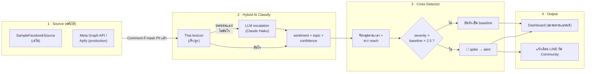
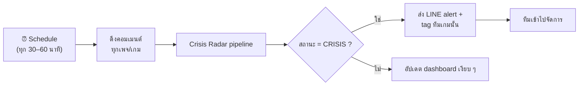
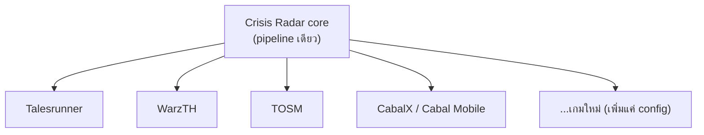

# 3. Workflow Diagram

## Pipeline หลัก (data flow)

## Orchestration ตอน production (n8n)

## Multi-tenant (ทำไม compact + ใช้ยาว)

> เพิ่มเกมใหม่ = เพิ่ม config เพจ + brand ไม่ต้องเขียนโค้ดใหม่ → 1 tool ดูแลทั้งเครือ
