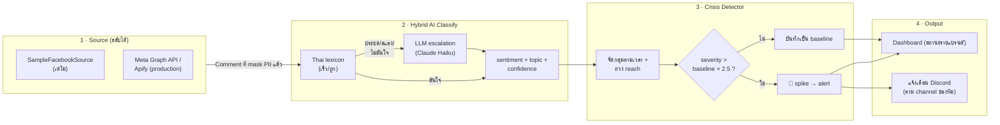
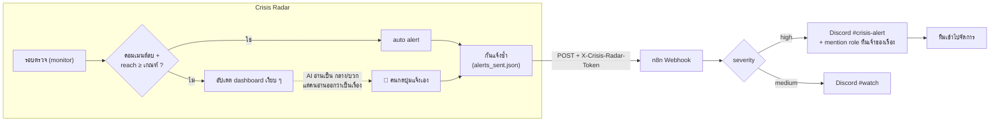
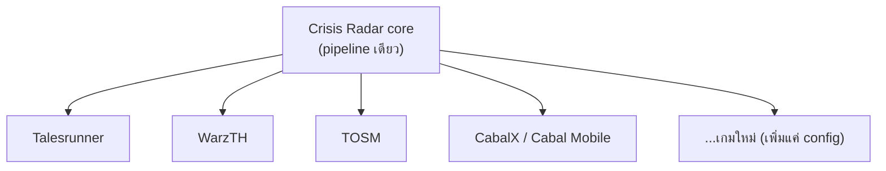

# 3. Workflow Diagram

## Pipeline หลัก (data flow)

## แจ้งเตือนเข้า Discord ผ่าน n8n (ทำงานจริงแล้ว)
Crisis Radar เป็นฝ่าย **ยิง webhook ออก** เมื่อมีเรื่องต้องแจ้ง — n8n รับแล้วเลือกปลายทาง
(รอบตรวจยังคุมด้วย monitor ในตัว ไม่ต้องพึ่ง Schedule ของ n8n)

> **ทำไมต้องมี 2 ทาง:** ระบบแจ้งเองครอบเฉพาะสิ่งที่ AI ตัดสินว่า "ลบและแรง" —
> เคสที่ AI อ่านพลาด (ให้เป็นกลาง/บวก) จะไม่มีวันถูกแจ้งเลย คนที่นั่งดูจึงต้องดันเข้า Discord เองได้
> · ตั้งค่า/ไฟล์ workflow: [`n8n/README.md`](../n8n/README.md)

## Multi-tenant (ทำไม compact + ใช้ยาว)

> เพิ่มเกมใหม่ = เพิ่ม config เพจ + brand ไม่ต้องเขียนโค้ดใหม่ → 1 tool ดูแลทั้งเครือ
