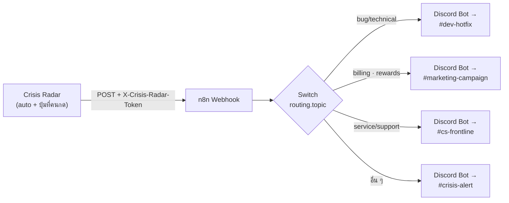

# เชื่อม Discord Bot กับ n8n เพื่อแสดงผล Crisis Radar

คู่มือทีละขั้นสำหรับต่อ **Discord Bot** เป็นปลายทางแสดงผล alert ของ Crisis Radar
(ทางลัดแบบ Incoming Webhook ที่ตั้ง 5 นาทีเสร็จอยู่ใน [`n8n/README.md`](../n8n/README.md) — เอกสารนี้คือทาง Bot เต็มรูปแบบ)



---

## 0. เลือกก่อน: Bot หรือ Incoming Webhook

ทั้งสองทางส่งข้อความหน้าตาเหมือนกันเป๊ะ (Crisis Radar ส่ง payload ชุดเดียวกัน) ต่างกันที่ความสามารถและงานที่ต้องตั้ง

| | Incoming Webhook | **Bot** |
|---|---|---|
| เวลาที่ใช้ตั้ง | ~5 นาที | ~20 นาที |
| ส่งข้อความ + embed | ✅ | ✅ |
| ส่งได้กี่ channel | 1 URL = 1 channel (หลาย channel = หลาย URL) | **ทุก channel ที่บอทเห็น ด้วย credential เดียว** |
| ping @role ตามทีม | ✅ (ถ้าตั้ง role id) | ✅ + คุมสิทธิ์ได้ละเอียดกว่า |
| ตอบกลับ / ปุ่มกด / thread | ❌ | ✅ (ต้องเขียนเพิ่ม) |
| อ่านข้อความในห้อง / slash command | ❌ | ✅ |
| ชื่อ+รูปผู้ส่ง | ตั้งได้ต่อ webhook | เป็นตัวตนเดียวทั้ง server (แก้ที่เดียว) |
| ถ้าโดนถอนสิทธิ์ | ลบ webhook ทีละอัน | ลบบอทออกจาก server ครั้งเดียวจบ |

> **เลือก Bot เมื่อ:** ต้องแยกหลาย channel ตามทีม (ซึ่งเป็นหัวใจของ Crisis Radar) · อยากให้ทีมกด "รับเรื่องแล้ว" ในอนาคต · หรือองค์กรอยากคุมสิทธิ์จากที่เดียว
> **เลือก Webhook เมื่อ:** แค่อยากเห็นผลเร็ว ๆ ห้องเดียว ตอนเดโม่

---

## 1. เตรียมของ

| ต้องมี | หมายเหตุ |
|---|---|
| สิทธิ์ **Manage Server** ใน Discord server ของทีม | ถ้าไม่มี ให้แอดมินทำข้อ 2–4 ให้ แล้วส่ง Bot Token + Channel ID มา |
| n8n ที่เข้าถึงได้จากอินเทอร์เน็ต | n8n Cloud หรือ self-host ที่มี public URL (Crisis Radar ต้องยิงเข้ามาได้) |
| Crisis Radar ที่รันอยู่ | local ก็ได้ แต่ถ้า n8n อยู่บน cloud ให้ deploy หรือใช้ tunnel (ngrok/cloudflared) |
| channel ใน Discord | อย่างน้อย 1 ห้อง แนะนำ: `#crisis-alert`, `#dev-hotfix`, `#marketing-campaign`, `#cs-frontline` |

---

## 2. สร้าง Application + Bot ใน Discord

1. เปิด <https://discord.com/developers/applications> → **New Application**
2. ตั้งชื่อ `Crisis Radar` → ติ๊กยอมรับข้อตกลง → **Create**
3. แท็บ **General Information** → ใส่รูป (App Icon) และ Description ให้ทีมรู้ว่าบอทนี้คืออะไร
   *(รูป/ชื่อตรงนี้คือสิ่งที่จะโชว์เป็นผู้ส่งข้อความ)*
4. แท็บ **Bot**
   - **Reset Token** → **Copy** → เก็บไว้ก่อน (Discord โชว์ครั้งเดียว หายแล้วต้อง reset ใหม่)
   - ปิด **Public Bot** — กันคนอื่นเชิญบอทนี้เข้า server ตัวเอง
   - **Privileged Gateway Intents** ปิดไว้ทั้งหมด (`Presence` / `Server Members` / `Message Content`)
     — งานส่ง alert ไม่ต้องใช้เลย เปิดไว้เปล่า ๆ = เพิ่มความเสี่ยงโดยไม่ได้อะไร

> 🔐 **Bot Token = รหัสผ่านของบอท** ใครได้ไปส่งข้อความในนามทีมได้ทันที
> ห้ามวางใน chat/commit ลง git — ที่เก็บที่ถูกต้องคือ Credential ของ n8n เท่านั้น (ข้อ 5)

---

## 3. เชิญบอทเข้า server (OAuth2)

1. แท็บ **OAuth2** → **URL Generator**
2. **Scopes:** ติ๊ก `bot`
   *(ติ๊ก `applications.commands` ด้วยถ้าอนาคตจะทำ slash command เช่น `/crisis status`)*
3. **Bot Permissions:** ติ๊กเท่าที่ใช้จริง

   | สิทธิ์ | ใช้ทำอะไร |
   |---|---|
   | View Channels | เห็นห้องที่จะส่ง |
   | Send Messages | ส่งข้อความ |
   | Embed Links | แสดงการ์ด embed (จำเป็น — ไม่มีอันนี้การ์ดจะไม่ขึ้น) |
   | Read Message History | จำเป็นเวลาตอบกลับ/reply ข้อความเดิม |
   | Mention Everyone | **เฉพาะเมื่อจะ ping @role** (ดูข้อ 7) |
   | Send Messages in Threads | เฉพาะถ้าจะส่งเข้า thread |
   | Attach Files | เฉพาะถ้าอนาคตจะแนบไฟล์/กราฟ |

4. คัดลอก **Generated URL** ด้านล่าง → เปิดในเบราว์เซอร์ → เลือก server ของทีม → **Authorize**

   ทางลัด (สิทธิ์ตามตารางข้างบนครบชุด) — แทน `<APPLICATION_ID>` ด้วยค่าจากแท็บ General Information:
   ```
   https://discord.com/api/oauth2/authorize?client_id=<APPLICATION_ID>&permissions=274878155776&scope=bot%20applications.commands
   ```

5. **สำคัญ — สิทธิ์ระดับห้อง:** ถ้าห้องไหนเป็น private ให้เข้า Channel Settings → **Permissions** →
   เพิ่ม role ของบอท (`Crisis Radar`) แล้วเปิด *View Channel* + *Send Messages* + *Embed Links*
   (บอทที่ "อยู่ใน server" ไม่ได้แปลว่า "เห็นทุกห้อง" — 403 Missing Access ส่วนใหญ่มาจากข้อนี้)

---

## 4. เก็บ Channel ID และ Role ID

1. Discord → **User Settings** → **Advanced** → เปิด **Developer Mode**
2. **Channel ID:** คลิกขวาที่ชื่อห้อง → **Copy Channel ID** → ได้เลขยาว ๆ เช่น `1122334455667788990`
3. **Role ID:** **Server Settings** → **Roles** → คลิกขวาที่ role → **Copy Role ID**

จดลงตารางนี้ไว้ใช้ในข้อ 6–7 (ทีมเจ้าของเรื่องอ้างอิงจาก `TOPIC_OWNER` ใน [`src/crisis/detector.py`](../src/crisis/detector.py)):

| `routing.topic` | ทีมที่ระบบส่งต่อให้ | channel ที่แนะนำ | Channel ID | Role ID |
|---|---|---|---|---|
| `bug/technical` | Dev / QA | `#dev-hotfix` | | |
| `billing/price` | Marketing / Monetization | `#marketing-campaign` | | |
| `rewards/redeem` | Marketing (แคมเปญ/โค้ด) + CS | `#marketing-campaign` | | |
| `balance/fairness` | Game Design | `#game-design` | | |
| `service/support` | Community / CS | `#cs-frontline` | | |
| `content/event` | Content / Event | `#content-event` | | |
| *(ไม่มี topic)* | Community | `#crisis-alert` | | |

---

## 5. สร้าง Credential ของบอทใน n8n

1. n8n → **Credentials** → **Add credential** → ค้นหา **Discord Bot API**
2. ใส่ **Bot Token** จากข้อ 2 → **Save**
3. ตั้งชื่อให้รู้เรื่อง เช่น `Discord — Crisis Radar Bot`

> ถ้าจะใช้วิธี HTTP Request (ข้อ 6 ทางที่ 1) ให้สร้าง **Header Auth** credential แทน:
> `Name` = `Authorization` · `Value` = `Bot <วาง token ที่นี่>`
> — คำว่า `Bot ` (มีเว้นวรรค) ต้องมีเสมอ ไม่งั้นจะได้ **401 Unauthorized**

---

## 6. ต่อ workflow ใน n8n

เริ่มจาก import [`n8n/crisis_radar_discord_alert.json`](../n8n/crisis_radar_discord_alert.json) แล้วแทนที่ node ปลายทาง
(`Discord #crisis-alert` / `Discord #watch`) ด้วยหนึ่งใน 2 ทางนี้

### ทางที่ 1 (แนะนำ) — HTTP Request ยิง Discord API ตรง

ใช้ payload ที่ Crisis Radar ประกอบมาแล้วทั้งก้อน ไม่ต้อง map field ทีละอัน → เวลาปรับข้อความในโค้ด Discord เปลี่ยนตามทันที

| ช่อง | ค่า |
|---|---|
| Method | `POST` |
| URL | `https://discord.com/api/v10/channels/<CHANNEL_ID>/messages` |
| Authentication | Generic Credential Type → **Header Auth** → เลือก credential จากข้อ 5 |
| Send Body | เปิด · Body Content Type: **JSON** · Specify Body: **Using JSON** |
| JSON | `={{ JSON.stringify($json.body.discord) }}` |

### ทางที่ 2 — Discord node ของ n8n

| ช่อง | ค่า |
|---|---|
| Credential | `Discord Bot API` จากข้อ 5 |
| Connection Type | **Bot** |
| Resource | **Message** · Operation: **Send** |
| Send To | **Channel** → เลือกจาก dropdown (หรือ By ID ใส่ Channel ID) |
| Message | `={{ $json.body.discord.content }}` |
| Options → Embeds | เปิด แล้วกรอกทีละฟิลด์ — Title/Description/Color/Footer map จาก `$json.body.discord.embeds[0]` |

> ข้อดี: มี UI ให้เลือก channel · ข้อเสีย: ต้องกรอก embed ทีละฟิลด์เอง และเวลาโค้ดฝั่ง Crisis Radar
> เพิ่มฟิลด์ใหม่ จะไม่ขึ้นจนกว่าจะมาแก้ที่ n8n อีกรอบ

### แยก channel ตามทีม

เปลี่ยน node `รุนแรงไหม` (IF) เป็น **Switch** node:

- Mode: **Rules** · Value: `={{ $json.body.routing.topic }}`
- Routing Rules: `bug/technical` → output 0 · `billing/price` → 1 · `rewards/redeem` → 1 · `service/support` → 2 …
- **Fallback Output: Extra Output** → ต่อเข้า `#crisis-alert` (คอมเมนต์ที่ AI ไม่ได้จัดประเด็นจะได้ไม่หายไปเงียบ ๆ)

อยากกรองความรุนแรงด้วย ให้วาง IF `={{ $json.body.severity }}` = `high` ไว้ก่อน Switch แล้วสาย `medium`
ส่งเข้าห้องเฝ้าระวังห้องเดียว

---

## 7. ให้บอท ping ทีมที่ต้องรับเรื่อง

Crisis Radar ใส่ `<@&role_id>` ลงในฟิลด์ `discord.content` ให้เองอยู่แล้ว ถ้าตั้ง env ฝั่ง Crisis Radar:

```bash
DISCORD_ROLE_MAP={"bug/technical":"1122334455667788","billing/price":"9988776655443322","rewards/redeem":"9988776655443322"}
```

จะ ping ได้จริงต้องครบ 3 อย่าง:

1. บอทมีสิทธิ์ **Mention Everyone** (ชื่อสิทธิ์ชวนเข้าใจผิด — มันคุมการ mention role ด้วย) **หรือ**
   ที่ Server Settings → Roles → role นั้น → เปิด **Allow anyone to @mention this role**
2. Role ID ถูกต้อง (ข้อ 4) — ใส่ผิดจะขึ้นเป็นข้อความดิบ `<@&123>` ไม่ ping ใคร
3. ไม่ได้ตั้ง `allowed_mentions` ปิดไว้ในฝั่ง n8n (ค่าเริ่มต้นของ Discord คือ ping ได้)

> อยากกันเผลอ ping ทั้งห้อง: เพิ่ม `"allowed_mentions": {"parse": ["roles"]}` เข้าไปใน JSON body
> ที่ node HTTP Request → `@everyone`/`@here` ที่หลุดมาในข้อความจะไม่ทำงาน แต่ role ยังปกติ

---

## 8. ตั้งค่าฝั่ง Crisis Radar

ใส่ใน `.env` (หรือ Environment ของ Render) แล้วรีสตาร์ท server:

```bash
N8N_WEBHOOK_URL=https://<your-n8n>/webhook/crisis-radar-alert   # Production URL ของ Webhook node
N8N_WEBHOOK_SECRET=<ค่าเดียวกับ Header Auth ที่ตั้งใน n8n>
PUBLIC_URL=https://<url ของ dashboard>                          # ลิงก์กลับที่แนบไปในข้อความ
DISCORD_ROLE_MAP={"bug/technical":"<role id>"}                  # ถ้าจะ ping ทีม
# ALERT_MIN_REACH=150 · ALERT_MAX_PER_RUN=5 · ALERT_AUTO=off    # ดู .env.example
```

> ⚠️ **Bot Token ไม่ต้องมาอยู่ฝั่ง Crisis Radar** — Crisis Radar รู้จักแค่ n8n
> token อยู่ใน n8n credential ที่เดียว เปลี่ยน/ถอนได้โดยไม่ต้อง deploy Crisis Radar ใหม่

---

## 9. ทดสอบทีละชั้น (ไล่จากปลายทางเข้ามา)

**ชั้น 1 — บอทส่งข้อความได้ไหม** (ยังไม่เกี่ยวกับ n8n)

```bash
curl -X POST "https://discord.com/api/v10/channels/<CHANNEL_ID>/messages" \
  -H "Authorization: Bot <BOT_TOKEN>" \
  -H "Content-Type: application/json" \
  -d '{"content":"ทดสอบจาก Crisis Radar"}'
```
ได้ `200` + ข้อความขึ้นในห้อง = ผ่าน · ได้ `401`/`403`/`404` → ดูตารางข้อ 10

**ชั้น 2 — workflow แปลง payload ถูกไหม**
เปิด workflow → **Listen for test event** → ที่เครื่อง dev ยิง payload จริงที่ระบบใช้:

```bash
curl -X POST "https://<your-n8n>/webhook-test/crisis-radar-alert" \
  -H "Content-Type: application/json" \
  -H "X-Crisis-Radar-Token: <N8N_WEBHOOK_SECRET>" \
  --data-binary @n8n/sample_payload.json
```
(`n8n/sample_payload.json` คือ payload จริงที่ pipeline สร้าง ไม่ได้เขียนมือ)

**ชั้น 3 — ปุ่มบนหน้าเว็บ**
เปิด Crisis Radar → การ์ด *อ่านคอมเมนต์จริง* → กด **🔔 แจ้ง Discord** ที่แถวไหนก็ได้ → ใส่เหตุผล → ส่ง
→ ต้องเด้งในห้องภายใน 1–2 วินาที และปุ่มเปลี่ยนเป็น **✓ แจ้งแล้ว**

**ชั้น 4 — ตัวส่งอัตโนมัติ**
กด **ตรวจใหม่ตอนนี้** → คอมเมนต์เชิงลบที่ไลก์+ตอบกลับเกิน `ALERT_MIN_REACH` ต้องเด้งเอง
(สูงสุด `ALERT_MAX_PER_RUN` ข้อความต่อรอบ และคอมเมนต์เดิมจะไม่เด้งซ้ำอีกเลย)

> อยากทดสอบซ้ำด้วยคอมเมนต์เดิม: ลบ `data/alerts_sent.json` แล้วตรวจใหม่
> (ไฟล์นี้คือตัวจำว่าเคยแจ้งอะไรไปแล้ว)

---

## 10. ปัญหาที่เจอบ่อย

| อาการ | สาเหตุ | วิธีแก้ |
|---|---|---|
| `401 Unauthorized` | token ผิด หรือลืมคำว่า `Bot ` หน้า token | Header ต้องเป็น `Authorization: Bot <token>` · token reset ใหม่แล้วอันเก่าใช้ไม่ได้ทันที |
| `403 Missing Access` | บอทไม่เห็นห้องนั้น | Channel Settings → Permissions → เพิ่ม role ของบอท + เปิด View Channel/Send Messages |
| `403 Missing Permissions` | ไม่มีสิทธิ์ Embed Links หรือ Mention Everyone | เชิญบอทใหม่ด้วย URL ที่ติ๊กสิทธิ์ครบ (ข้อ 3) — ไม่ต้องเตะบอทออก เปิดลิงก์ authorize ซ้ำได้เลย |
| `404 Unknown Channel` | Channel ID ผิด (คัดลอกมาจาก server อื่น / เอา URL มาแทน ID) | เปิด Developer Mode แล้ว Copy Channel ID ใหม่ |
| `400 Bad Request` มี `embeds` ในข้อความ error | ฟิลด์เกิน limit หรือ value ว่าง | ดูภาคผนวก A — ส่วนใหญ่มาจาก field value เป็นค่าว่าง |
| `429 Too Many Requests` | ยิงถี่เกิน (5 ข้อความ / 5 วินาที ต่อห้อง) | ลด `ALERT_MAX_PER_RUN` หรือใส่ Wait node คั่น 1 วินาที |
| ข้อความขึ้นแต่ไม่ ping ใคร | role id ผิด หรือบอทไม่มีสิทธิ์ mention | ดูข้อ 7 ทั้ง 3 ข้อ |
| หน้าเว็บขึ้น **502 ต่อ webhook ไม่ได้** | n8n ปิดอยู่ / workflow ยังไม่ Activate / URL เป็น `webhook-test` | Activate workflow แล้วใช้ **Production URL** (`/webhook/...` ไม่ใช่ `/webhook-test/...`) |
| หน้าเว็บขึ้น **400 แจ้งไปแล้วเมื่อ …** | คอมเมนต์นี้เคยแจ้งแล้ว (กันเด้งซ้ำ) | ตั้งใจให้เป็นแบบนั้น — ถ้าจะส่งซ้ำจริง ๆ กดปุ่มในกล่องอีกครั้ง (`ส่งซ้ำเข้า Discord`) |
| ไม่มีอะไรเด้งเลย แต่ไม่มี error | `ALERT_AUTO=off` หรือไม่มีคอมเมนต์ถึงเกณฑ์ | เช็ก `GET /api/health` → `alert.configured` / `alert.auto` / `alert.min_reach` |

---

## 11. ความปลอดภัย

- **Bot Token** อยู่ใน n8n credential ที่เดียว — ไม่อยู่ใน repo, ไม่อยู่ใน env ของ Crisis Radar
  หลุดเมื่อไหร่ให้ **Reset Token** ทันที (บอทเก่าจะถูกตัดทันทีโดยไม่ต้องแก้โค้ด)
- **สิทธิ์เท่าที่ใช้** — ไม่ต้องให้ Administrator เด็ดขาด · ปิด Public Bot · ปิด Privileged Intents
- **ขาเข้า n8n** ป้องกันด้วย Header Auth (`X-Crisis-Radar-Token`) — ถ้าไม่มี ใครก็ยิง webhook ปลอมเข้าห้องทีมได้
- **ขาเข้า Crisis Radar** `/api/alert` ล็อกด้วย `RUN_PASSCODE` เดียวกับการแก้ label
- **ข้อมูลที่ไหลออก** ข้อความคอมเมนต์จริง + ชื่อผู้คอมเมนต์ → ส่งเข้า channel **ภายในทีมเท่านั้น**
  ห้ามตั้งปลายทางเป็นห้องสาธารณะ/ชุมชนผู้เล่น (ดู [7_security.md](7_security.md) §3.2)
- **ผู้ดูแล** ควรมีมากกว่า 1 คนที่เข้า Developer Portal ได้ ไม่งั้นคนลาออกแล้วบอทแก้ไม่ได้

---

## 12. เช็กลิสต์ก่อนบอกทีมว่าใช้ได้แล้ว

- [ ] บอทอยู่ใน server และเห็นทุกห้องปลายทาง (ทดสอบด้วย curl ข้อ 9 ชั้น 1 ผ่านทุกห้อง)
- [ ] workflow **Activate** แล้ว และใช้ Production URL
- [ ] Header Auth ตรงกันทั้ง 2 ฝั่ง (`N8N_WEBHOOK_SECRET`)
- [ ] `PUBLIC_URL` ชี้ไป dashboard จริง — ปุ่มในการ์ดกดแล้วเปิดได้
- [ ] กดปุ่ม 🔔 จากหน้าเว็บแล้วเด้งจริง และปุ่มเปลี่ยนเป็น ✓ แจ้งแล้ว
- [ ] ตรวจรอบใหม่แล้ว auto alert เด้ง และ**ไม่เด้งซ้ำ**ในรอบถัดไป
- [ ] แต่ละ topic เข้าห้องถูกทีม (ทดสอบด้วย `sample_payload.json` แก้ `routing.topic` ให้ครบทุกค่า)
- [ ] ping ทีมได้จริง (ถ้าตั้ง `DISCORD_ROLE_MAP`)
- [ ] mount disk ถาวรให้ `data/alerts_sent.json` แล้ว (ไม่งั้น restart ทีเดียวทีมโดนแจ้งซ้ำทั้งกอง)

---

## ภาคผนวก A — ข้อจำกัดของ Discord ที่ควรรู้

| รายการ | ลิมิต | Crisis Radar จัดการยังไง |
|---|---|---|
| Embed title | 256 ตัวอักษร | ตัดที่ 250 |
| Embed description | 4,096 | ตัดข้อความคอมเมนต์ที่ 500 (ยาวกว่านั้นคนไม่อ่านบนมือถือ) |
| Field value | 1,024 | ตัดที่ 900 |
| Field ต่อ embed | 25 | ใช้จริง 4–7 |
| ทุกอย่างรวมใน 1 embed | 6,000 | ไม่มีทางถึงด้วยขนาดข้างบน |
| Embed ต่อข้อความ | 10 | ใช้ 1 |
| อัตราส่ง | ~5 ข้อความ / 5 วินาที ต่อห้อง | `ALERT_MAX_PER_RUN` (เริ่มต้น 5) ต่อรอบตรวจ |

## ภาคผนวก B — ฟิลด์ใน payload ที่ใช้บ่อยใน n8n

payload เต็มดูได้ที่ [`n8n/sample_payload.json`](../n8n/sample_payload.json) · โครงสร้างมาจาก [`src/notify/payload.py`](../src/notify/payload.py)

```
{{ $json.body.discord }}                 ข้อความสำเร็จรูป (content + embeds) — ยิงเข้า Discord ได้ตรง ๆ
{{ $json.body.severity }}                high | medium
{{ $json.body.trigger }}                 auto (ระบบเจอเอง) | manual (คนกดแจ้ง)
{{ $json.body.reason }}                  เหตุผลภาษาคนว่าทำไมถึงเด้ง
{{ $json.body.routing.topic }}           bug/technical · billing/price · rewards/redeem · …
{{ $json.body.routing.owner }}           ทีมที่ต้องรับเรื่อง (ข้อความไทย/อังกฤษ)
{{ $json.body.routing.role_id }}         role ที่จะ ping (ว่าง = ไม่ ping)
{{ $json.body.comment.text }}            ข้อความคอมเมนต์
{{ $json.body.comment.author }}          ชื่อผู้คอมเมนต์
{{ $json.body.comment.reach }}           ไลก์ + ตอบกลับ
{{ $json.body.comment.url }}             ลิงก์ตรงไปคอมเมนต์นั้นบน Facebook
{{ $json.body.comment.sentiment }}       positive | neutral | negative (ค่าล่าสุด)
{{ $json.body.comment.ai_sentiment }}    ค่าที่ AI ทายไว้เดิม — เทียบกันเพื่อดูว่าคนแก้ไปจากอะไร
{{ $json.body.report.status }}           NORMAL | WATCH | CRISIS (สถานะเพจตอนที่ยิง)
{{ $json.body.report.dashboard_url }}    ลิงก์กลับ dashboard
```

## ภาคผนวก C — ต่อยอดได้อีก (ยังไม่ได้ทำ)

| อยากได้ | ทำยังไง |
|---|---|
| ปุ่ม "รับเรื่องแล้ว" ในการ์ด | ต้องใช้ Bot + `components` (button) + endpoint รับ interaction — ทำได้เฉพาะทาง Bot เท่านั้น |
| สรุปทั้งรอบเป็นข้อความเดียว | เพิ่ม event ใหม่ฝั่ง Crisis Radar (`report_alert`) แล้วให้ n8n แยกตาม `$json.body.event` |
| เปิด thread ต่อ 1 ดราม่า | Discord node → Resource: Channel → Create Thread แล้วส่งข้อความตามเข้า thread id |
| ส่งเข้า Jira/Sheet ด้วย | ต่อ node เพิ่มหลัง Switch — payload มี `comment` ครบอยู่แล้ว ไม่ต้องแก้ Crisis Radar |
| slash command `/crisis status` | เพิ่ม scope `applications.commands` + n8n webhook รับ interaction แล้วเรียก `GET /api/monitor` |
